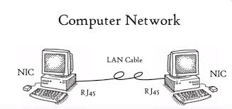

# OPEN SYSTEM INTERCONNECTION MODEL (OSI MODEL)

OSI model defines and is used to understand how data is transferred from one computer to another in a computer network. Ever wondered how the communication between two system will take place if one is based on MAC and other is having Microsoft windows operating system installed?

