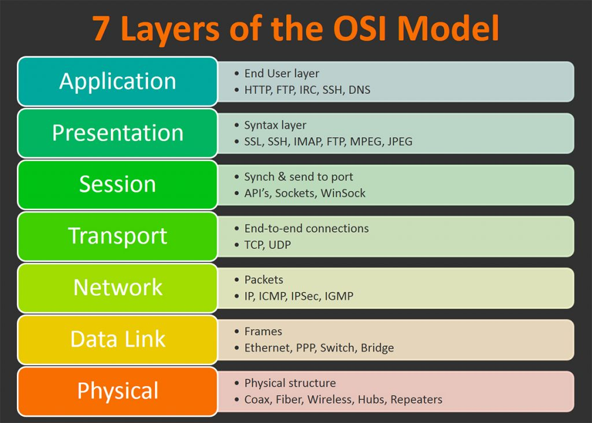

# OPEN SYSTEM INTERCONNECTION MODEL (OSI MODEL)

OSI model defines and is used to understand how data is transferred from one computer to another in a computer network. Ever wondered how the communication between two system will take place if one is based on MAC and other is having Microsoft windows operating system installed?

So in order to accomplish successful communication between computers or networks of different architectures seven layer architecture OSI model was introduced by ISO 1984 containing layers shown in the picture below

Where each layer is package of protocols. Let’s start with all the layers of the model one by one.

---

* ## Application Layer

It is used by network applications. Network application means computer applications that use internet such as google chrome, skype, fire fox etc. There are dozens of protocols such as HTTP, NFS, DHCP etc. All these protocols forms various services such as file transfer needs FTP, web surfing needs HTTP protocol, Emails etc.

* ## Presentation Layer

It receives data from top most layer. Presentation layer helps in data translation that is conversion of characters into binary digits, data encryption and data compression that is compressing the data to small size so that it can be transferred faster.
Protocols which form presentation layer is NFS, DHCP, SNMP etc.

* ## Session Layer

It plays an important role in setting up and maintaining the connection between different systems. Top most functionalities of session layer are system authentication, system authorization, and also session management. protocols are RPC,SCP,SDP etc.

* ## Transport Layer

It keeps a check of reliability of data communication. Top functions of this layer are segmentation, flow control, error control , connection oriented transmission and connectionless transmission. Protocols are TCP,UDP etc.

* ## Network Layer

It receives data from above and transfers them from one to another computer on different network. Logical addressing , Routing and path determination are its main functionalities it performs. Protocols are OSPF,BGP etc.

* ## Data Link Layer

It receives data from network layer. It allows upper layers to use the media using framing technique. Media access control and error detection are also main functions of data link layer.

* ## Physical Layer

It performs a vital role in OSI model. Functionalities such as digital transmission , digital data to digital signal conversion and line coding etc. protocols used in this layer are Ethernet, FDDI etc.
